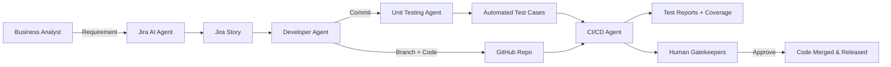

# Redefining Development Effort with AI Agents

## Introduction  
AI agents are beginning to reshape how organizations plan, develop, and test software. Rather than replacing humans, the emerging model positions **humans as gatekeepers** who define business intent, review quality, and approve changes, while **AI agents act as developers** that generate stories, code, and tests at scale. This dual model blends accountability with automation, creating a development flow that is both fast and governed.

---

## Operational Model: Humans as Gatekeepers, AI as Developers

### **Role of Humans (Gatekeepers)**  
- **Business Analysts (BAs):** Provide well-defined requirements and validate AI-generated Jira stories for completeness and correctness.  
- **Tech Leads/Architects:** Act as reviewers of AI-generated code and tests before merge.  
- **QA Leads:** Validate that test cases align with business acceptance criteria and regulatory requirements.  
- **Product Owners:** Approve release readiness after AI agents have delivered and validated working code.  

### **Role of AI Agents (Developers)**  
- **Jira Agent:** Breaks down BA requirements into granular epics/stories with acceptance criteria and test validations.  
- **Developer Agents:** Create GitHub branches, generate code, and push commits.  
- **Unit Testing Agent:** Auto-generates test suites aligned with acceptance criteria.  
- **CI/CD Agent:** Runs builds, executes test cases, enforces quality gates, and produces reports.  

This ensures **humans set intent and enforce governance**, while **AI agents handle repeatable, scalable development work**.  

---

## Example Requirement Walkthrough

### **Step 1: Requirement from BA (Human)**  
_Business Requirement:_  
> Customers should be able to view their recent transactions in the banking app, showing the last 10 debits and credits with date, description, and amount.  

---

### **Step 2: Jira Agent Creates Story**  
**Story Title:**  
_As a banking customer, I want to view my last 10 transactions so that I can track my recent account activity._  

**Description:**  
- Display last 10 transactions (date, description, amount).  
- Support both debit and credit transactions.  
- Must refresh in real-time when the customer logs in.  

**Acceptance Criteria:**  
```
Given a logged-in customer  
When they open the transactions page  
Then the system should display their last 10 transactions (date, description, amount)  
```

**Test Validation Requirements:**  
- Verify exactly 10 transactions are shown.  
- Validate ordering by most recent first.  
- Edge case: Fewer than 10 transactions → display available ones.  
- Response time must be < 2 seconds for 95% of requests.  

---

### **Step 3: Developer Agent Generates Code**  
- Creates a new GitHub branch: `feature/transaction-history`.  
- Generates API endpoint `/transactions/recent`.  
- Implements query logic:  
  ```sql
  SELECT date, description, amount
  FROM transactions
  WHERE customer_id = :id
  ORDER BY date DESC
  LIMIT 10;
  ```  
- Creates UI component `RecentTransactionsList` in React/Angular/Flutter (language-specific).  
- Commits code with message: _“Add endpoint + UI for last 10 transactions”_.  

---

### **Step 4: Unit Testing Agent Writes Tests**  
- **Unit Tests:**  
  - Fetch 10 records for a user with >10 transactions.  
  - Fetch all records for a user with <10 transactions.  
  - Validate ordering (most recent first).  
  - Validate empty state message for users with no transactions.  
- **Integration Test:**  
  - API response returns JSON with fields `date, description, amount`.  
- **Performance Test Stub:**  
  - Ensure API responds within SLA (2 seconds).  

---

### **Step 5: CI/CD Agent Executes Pipeline**  
- Runs static code analysis and linting.  
- Executes all unit tests and integration tests.  
- Generates code coverage report (target: 85%+).  
- Publishes deployment preview for QA Lead to validate.  

---

### **Step 6: Human Gatekeeper Review**  
- **Tech Lead:** Reviews API logic and UI rendering for compliance with security and coding standards.  
- **QA Lead:** Validates that test coverage matches acceptance criteria and business requirement.  
- **Product Owner:** Signs off once preview matches customer experience expectations.  

---

## Flow with Gatekeeper Model



---

## Benefits of This Model
- **Governance First:** Humans retain oversight and final approval.  
- **Repeatability:** Stories and tests follow a consistent, structured format.  
- **Transparency:** Every step is logged, traceable, and reviewable.  
- **Scalability:** Multiple AI developer agents can work in parallel on different branches.  

---

## Conclusion  
By positioning humans as **gatekeepers** and AI as **execution agents**, organizations can strike a balance between speed and accountability. With a standardized Jira story format that includes granular requirements, acceptance criteria, and validation rules, the development cycle becomes **predictable, auditable, and scalable**.  

This model represents the future of software development—where **humans define intent and guardrails, and AI delivers execution at machine speed**.  
