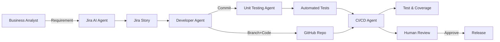

# AI-SDLC-VISION · Humans as Gatekeepers, AI as Developers

[](#)
[](LICENSE)

> A reference blueprint for an AI-accelerated SDLC where humans define intent & guardrails, and AI agents generate stories, code, and tests.

## Why
- **Governed speed**: AI scales delivery; humans approve merges.
- **Repeatability**: standardized story & test patterns.
- **Traceability**: every artifact is reviewable.

## Architecture (high-level)


## Quickstart (local demo)
```bash
uv venv && source .venv/bin/activate  # or python -m venv
pip install -r requirements.txt
pytest -q
```

## Roadmap
- [ ] Minimal Jira/GitHub integration behind feature flags
- [ ] LLM adapters (Bedrock, OpenAI) with offline fallback
- [ ] Golden path: story → branch → code → tests → PR → checks

## Contributing
See [CONTRIBUTING.md](CONTRIBUTING.md). Security policy in [SECURITY.md](SECURITY.md).
